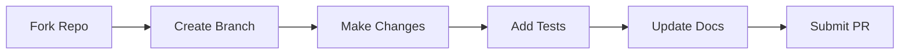

# �� Contributing to B8 Platform

[](http://makeapullrequest.com)

> 💡 We love your input! We want to make contributing to B8 Platform as easy and transparent as possible.

<details>
<summary>📖 Table of Contents</summary>

- [Ways to Contribute](#ways-to-contribute)
- [Development Process](#development-process)
- [Bug Reports](#bug-reports)
- [Coding Style](#coding-style)
- [Code of Conduct](#code-of-conduct)
- [License](#license)
</details>

## 🌟 Ways to Contribute

| Type | Description |
|------|-------------|
| 🐞 [Report Bugs](#bug-reports) | Help us identify issues |
| 💬 [Discuss Code](#development-process) | Share your insights |
| 🔧 [Submit Fixes](#development-process) | Help resolve issues |
| ✨ [Propose Features](#development-process) | Suggest improvements |
| 👥 [Become a Maintainer](#development-process) | Join our core team |

## 🔄 Development Process

We use [Github Flow](https://guides.github.com/introduction/flow/index.html). Here's how to propose changes:



<details>
<summary>Step-by-step guide</summary>

1. Fork the repo and create your branch from `main`:
   ```bash
   git checkout -b feature/amazing-feature
   ```

2. Make your changes and test them:
   ```bash
   npm run test
   npm run lint
   ```

3. Update documentation if needed

4. Create a pull request:
   ```bash
   git push origin feature/amazing-feature
   ```
</details>

## 🐞 Bug Reports

> **Note:** Please use our [issue template](https://github.com/Hum2a/B8/issues/new?template=bug_report.md) when reporting bugs.

A great bug report should include:

<details>
<summary>Essential elements of a bug report</summary>

- [ ] Quick summary
- [ ] Steps to reproduce
- [ ] Expected behavior
- [ ] Actual behavior
- [ ] Notes and context
- [ ] Screenshots (if applicable)
- [ ] Error logs
</details>

### Example Bug Report Format

```markdown
**Description:**
Brief description of the issue

**Steps to Reproduce:**
1. Go to '...'
2. Click on '....'
3. See error

**Expected Behavior:**
What should happen

**Actual Behavior:**
What actually happens
```

## ✍️ Coding Style

We follow strict coding standards to maintain consistency:

<details>
<summary>View coding standards</summary>

- ✅ Use TypeScript for all new code
- ✅ 2 spaces for indentation
- ✅ Meaningful variable and function names
- ✅ Comment complex logic
- ✅ Write tests for new features
</details>

### Code Quality Checks

```bash
# Run linter
npm run lint

# Run type checks
npm run type-check

# Run tests
npm run test
```

## 📜 Code of Conduct

### Our Pledge

> We pledge to make participation in our project a harassment-free experience for everyone.

<details>
<summary>View our standards</summary>

#### Positive Behavior Examples:
- ✅ Using welcoming language
- ✅ Respecting different viewpoints
- ✅ Accepting constructive criticism
- ✅ Focusing on community benefits
- ✅ Showing empathy

#### Unacceptable Behavior:
- ❌ Harassment of any kind
- ❌ Discriminatory jokes and language
- ❌ Personal or political attacks
- ❌ Publishing others' private information
- ❌ Other unprofessional conduct
</details>

## ⚖️ License

By contributing, you agree that your contributions will be licensed under the [MIT License](LICENSE).

---

<div align="center">

**Thank you for contributing to B8 Platform! 🎉**

</div> 