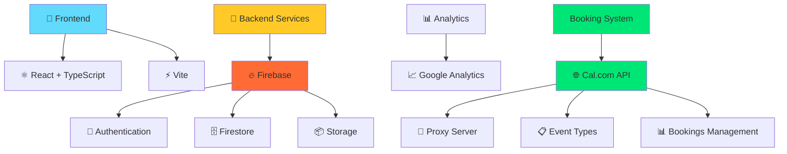

<div align="center">

# 🌟 bgr8 Platform

> **Empowering individuals through community and mentorship**

[](https://opensource.org/licenses/MIT)
[](CHANGELOG.md)
[](https://www.typescriptlang.org/)
[](https://reactjs.org/)
[](https://vitejs.dev/)
[](https://firebase.google.com)
[](CONTRIBUTING.md)

[](https://github.com/Hum2a/bgr8/actions/workflows/lint.yml)
[](https://github.com/Hum2a/bgr8/actions/workflows/code_quality.yml)

---

**A focused mentoring and community platform, centered around the BGr8 initiative and powered by a unique MentorAlgorithm.**

[🚀 Quick Start](#-quick-start) • [📖 Documentation](#-documentation) • [🤝 Contributing](#-contributing) • [📄 License](#-license)

</div>

---

## 📋 Table of Contents

<details open>
<summary><strong>📖 Quick Navigation</strong></summary>

- [🎯 Overview](#-overview)
- [✨ Features](#-features)
- [🛠️ Tech Stack](#️-tech-stack)
- [⚡ Quick Start](#-quick-start)
- [📋 Prerequisites](#-prerequisites)
- [🚀 Installation](#-installation)
- [🌐 Deployment](#-deployment)
- [🔧 Environment Variables](#-environment-variables)
- [🧪 Testing](#-testing)
- [📁 Project Structure](#-project-structure)
- [🤝 Contributing](#-contributing)
- [📄 License](#-license)
- [🔒 Security](#-security)
- [📞 Contact](#-contact)
- [🙏 Acknowledgments](#-acknowledgments)

</details>

---

## 🎯 Overview

<div align="center">

| 🏢 **Platform Unit** | 📝 **Description** | 🚀 **Status** |
|:--------------------:|:------------------:|:-------------:|
| 🌟 **BGr8** | Community, events, and mentoring | ✅ **Live** |

</div>

**bgr8 Platform** is dedicated to empowering individuals through the BGr8 community and a robust mentoring program. Our platform focuses exclusively on creating meaningful connections and fostering growth through:

- 🤝 **Community Building** - Connect with like-minded individuals
- 🎓 **Mentorship Programs** - Advanced algorithm-based matching
- 📈 **Personal Growth** - Structured learning and development
- 🌍 **Diverse Network** - Inclusive and supportive environment

---

## ✨ Features

<details>
<summary><strong>🌟 Click to explore our amazing features!</strong></summary>

### 🎯 Core Features

| Feature | Description | Status |
|---------|-------------|:------:|
| 🌟 **BGr8 Community Hub** | Centralized community platform | ✅ Live |
| 🤝 **Mentor Matching** | Advanced MentorAlgorithm system | ✅ Live |
| 📅 **Cal.com Booking System** | Third-party calendar integration | ✅ Live |
| 🔒 **Secure Authentication** | Firebase-powered security | ✅ Live |
|  **Responsive Design** | Mobile-first approach | ✅ Live |
| 📊 **Analytics Dashboard** | Comprehensive insights | ✅ Live |
| 💬 **Admin Management** | Complete control panel | ✅ Live |

### ⚡ Technical Features

| Technology | Purpose | Status |
|------------|---------|:------:|
| 🔑 **Firebase Auth** | User authentication | ✅ Live |
| 🔥 **Firestore DB** | Real-time database | ✅ Live |
|  **Cal.com Integration** | Advanced booking system | ✅ Live |
| 🔗 **Proxy Server** | CORS-free API access | ✅ Live |
| ⚡ **Real-time Updates** | Live data synchronization | ✅ Live |
| 🧑‍💻 **React + TypeScript** | Modern frontend stack | ✅ Live |

</details>

---

## 🛠️ Tech Stack

<div align="center">



**Our platform leverages cutting-edge technologies for optimal performance and user experience.**

</div>

---

## ⚡ Quick Start

<div align="center">

**Get up and running in under 5 minutes! 🚀**

Requires local instance of Cal.com server running in the background.  
See in Calcom-Server [repo](https://github.com/YakMan101/B8-Calcom-Server)

</div>

### 1️⃣ Clone the repository

```bash
git clone https://github.com/Hum2a/bgr8.git
cd bgr8
```

### 2️⃣ Install dependencies

```bash
npm install
```

### 3️⃣ Set up environment

Get `.env` file from Hum2a (see Environment Variables section for details)

### 4️⃣ (Optional) Start Firebase emulators for development

For local development with Firebase emulators, see detailed setup instructions in [firebase_emulator/README.md](firebase_emulator/README.md)

### 5️⃣ Start development server

```bash
npm run dev
```

---

## 📋 Prerequisites

<div align="center">

**Before you begin, ensure you have the following installed:**

</div>

| Requirement | Version | Download |
|-------------|---------|----------|
| 🟢 **Node.js** | `v16.x` or higher | [Download](https://nodejs.org/) |
| 📦 **npm** | `v8.x` or higher | [Included with Node.js](https://nodejs.org/) |
| 🔥 **Firebase Account** | Any | [Sign Up](https://firebase.google.com/) |

---

## 🚀 Installation

<details>
<summary><strong>📋 Detailed Installation Guide</strong></summary>

### Step 1: Repository Setup

```bash
# Clone the repository
git clone https://github.com/Hum2a/bgr8.git

# Navigate to project directory
cd bgr8
```

### Step 2: Dependencies Installation

```bash
# Install all dependencies
npm install
```

### Step 3: Environment Configuration

> **⚠️ Important:** You will need your own Firebase account.
> Get the correct `.env` file from Hum2a to place in the root directory.

### Step 4: Launch Development Server

```bash
# Start the main application
npm run dev
```

**🎉 Congratulations! Your development environment is now ready.**

</details>

---

## 🌐 Deployment

<details>
<summary><strong>🚀 Deployment Instructions</strong></summary>

### Production Build

```bash
# Create optimized production build
npm run build

# Preview production build locally
npm run preview
```

### Deployment Options

| Platform | Instructions | Status |
|----------|-------------|:------:|
| 🚀 **Vercel** | Connect GitHub repo | ✅ Supported |
| ☁️ **Netlify** | Drag & drop build folder | ✅ Supported |
| 🔥 **Firebase Hosting** | `firebase deploy` | ✅ Supported |
| 🐳 **Docker** | Use provided Dockerfile | 🔄 Coming Soon |

</details>

---

## 🔧 Environment Variables

<div align="center">

**Required environment variables for full functionality**

</div>

<details>
<summary><strong>🔐 View all environment variables</strong></summary>

### Frontend Variables (`.env`)

| Variable | Description | Required | Example |
|----------|-------------|:--------:|---------|
| `VITE_FIREBASE_API_KEY` | Firebase API Key | ✅ | `AIzaSyC...` |
| `VITE_FIREBASE_AUTH_DOMAIN` | Firebase Auth Domain | ✅ | `project.firebaseapp.com` |
| `VITE_FIREBASE_PROJECT_ID` | Firebase Project ID | ✅ | `your-project-id` |
| `VITE_FIREBASE_STORAGE_BUCKET` | Firebase Storage Bucket | ✅ | `project.appspot.com` |
| `VITE_FIREBASE_MESSAGING_SENDER_ID` | Firebase Messaging Sender ID | ✅ | `123456789` |
| `VITE_FIREBASE_APP_ID` | Firebase App ID | ✅ | `1:123456789:web:abc123` |
| `VITE_FIREBASE_MEASUREMENT_ID` | Firebase Measurement ID | ✅ | `G-XXXXXXXXXX` |

</details>

---

## 🏷️ Release Tag Manager

<div align="center">

**`release.sh`** - A cross-platform bash script for managing semantic versioned release tags

</div>

### Prerequisites

- ✅ Git installed and configured
- ✅ Remote repository set up (`origin`)
- ✅ Bash shell (works on Linux/macOS/Git Bash for Windows)

#### Windows PowerShell Alias Setup

```powershell
Set-Alias -Name bash -Value "<absolute_path_to_git_installation>\bin\bash.exe"
# Example: C:\Program Files\Git\bin\bash.exe
```

### Usage

```bash
# Linux/MacOS
./release.sh [OPTIONS]

# Windows
bash release.sh [OPTIONS]
```

### Available Options

| Flag | Description | Example |
|------|-------------|---------|
| `--major` | Increment major version | `v2.0.0` |
| `--minor` | Increment minor version | `v1.1.0` |
| `--patch` | Increment patch version | `v1.0.1` (default) |
| `--name NAME` | Append custom name | `--name beta` → `v1.0.0-beta` |
| `--set-tag TAG` | Set specific tag | `--set-tag v1.2.3` |
| `--current` | Show current release tag | Displays current version |
| `--force` | Force tag creation | Override existing tags |
| `--help` | Show help message | Display usage information |

### Behavior

1. 🔄 **Always syncs** with remote tags first
2. ✅ **Validates** tag format (vX.Y.Z or vX.Y.Z-NAME)
3. 🚫 **Prevents** duplicate tags

---

## 🧪 Testing

<div align="center">

**Comprehensive testing suite for quality assurance**

</div>

<details>
<summary><strong>🧪 Testing Commands</strong></summary>

```bash
# Run unit tests
npm run test

# Run end-to-end tests
npm run test:e2e

# Run tests in CI environment
npm run test:ci

# Run tests with coverage
npm run test:coverage
```

### Test Coverage Goals

| Type | Coverage Target | Current Status |
|------|----------------|:--------------:|
| 🧪 **Unit Tests** | 80%+ | 🔄 In Progress |
| 🔄 **Integration Tests** | 70%+ | 🔄 In Progress |
| 🎯 **E2E Tests** | 60%+ | 🔄 In Progress |

</details>

---

## 📁 Project Structure

<details>
<summary><strong>📂 View complete project structure</strong></summary>

```
bgr8/
├── 📁 src/
│   ├── 🧩 components/         # React components
│   │   ├── 👨‍💼 admin/          # Admin-specific components
│   │   ├── 🎬 animations/      # Animation components
│   │   ├── 🎨 ui/              # UI components
│   │   ├── 🧠 widgets/         # Widget components
│   │   │   └── 🎓 MentorAlgorithm/  # Mentor matching logic
│   │   └── 🛡️ ProtectedRoute.tsx
│   ├── 📄 pages/              # Page components
│   │   ├── 👨‍💼 adminPages/      # Admin pages
│   │   ├── � authPages/       # Authentication pages
│   │   ├── �💼 businessPages/   # Business pages
│   │   └── 🛠️ utilPages/        # Utility pages
│   ├── 🎨 styles/             # CSS stylesheets
│   │   ├── �‍💼 adminStyles/    # Admin-specific styles
│   │   ├── 💼 businessStyles/  # Business-specific styles
│   │   ├── 🧩 components/      # Component-specific styles
│   │   └── � payment/         # Payment-related styles
│   ├── 🪝 hooks/              # Custom React hooks
│   ├── 🔄 contexts/           # React context providers
│   ├── 🛠️ utils/              # Utility functions
│   ├── 📝 types/              # TypeScript type definitions
│   ├── 🔥 firebase/           # Firebase configuration
│   ├── 🛡️ middleware/         # Security middleware
│   ├── 🧭 navigation/         # Navigation logic
│   ├── 📊 constants/          # Application constants
│   ├── 🔧 config/             # Configuration files
│   └── 🎨 assets/             # Static assets (images, etc.)
├── 🌐 public/                 # Public static assets
├── 🔥 firebase_emulator/      # Firebase emulator configuration
│   ├── 📄 README.md           # Emulator setup instructions
│   ├── 📜 download_cloud_data.sh # Data export script
│   ├── ⚙️ firebase.json       # Firebase configuration
│   ├── 🔧 .firebaserc        # Firebase project configuration
│   ├── 🛡️ firestore.rules    # Firestore security rules
│   ├── 📁 storage.rules      # Storage security rules
│   └── 📊 data/              # Exported data storage
├── 📄 docs/                  # Documentation files
├── 🔒 .env                   # Environment variables
├── 📦 package.json           # Dependencies and scripts
├── ⚙️ vite.config.ts         # Vite configuration
├── 📝 tsconfig.json          # TypeScript configuration
├── 🎨 eslint.config.js       # ESLint configuration
├── 🏷️ release.sh             # Release tag manager script
└── 📄 README.md              # This file
```

</details>

---

## 🤝 Contributing

<div align="center">

**We welcome contributions from the community! 🌟**

</div>

<details>
<summary><strong>📋 Contributing Guidelines</strong></summary>

### How to Contribute

1. 🍴 **Fork** the repository
2. 🌿 **Create** a feature branch (`git checkout -b feature/amazing-feature`)
3. 💾 **Commit** your changes (`git commit -m 'Add amazing feature'`)
4. 📤 **Push** to the branch (`git push origin feature/amazing-feature`)
5. 🔄 **Open** a Pull Request

### Development Guidelines

- ✅ Follow TypeScript best practices
- 🎨 Maintain consistent code style
- 📝 Write meaningful commit messages
- 🧪 Add tests for new features
- 📚 Update documentation as needed

### Code of Conduct

We are committed to providing a welcoming and inspiring community for all. Please read our [Code of Conduct](CODE_OF_CONDUCT.md) for details.

</details>

---

## 📄 License

<div align="center">

**This project is licensed under the MIT License - see the [LICENSE](LICENSE) file for details.**

[](https://opensource.org/licenses/MIT)

</div>

---

## 🔒 Security

<div align="center">

**Security is our top priority**

</div>

<details>
<summary><strong>🛡️ Security Information</strong></summary>

### Reporting Security Issues

If you discover a security vulnerability, please:

1. 🔒 **Do NOT** create a public GitHub issue
2. 📧 **Email** us directly at [security@bgr8.com](mailto:security@bgr8.com)
3. ⏰ **Wait** for our response (we aim to respond within 24 hours)

### Security Features

- 🔐 **Firebase Authentication** - Secure user management
- 🛡️ **Input Validation** - Comprehensive data sanitization
- 🔒 **HTTPS Only** - Encrypted data transmission
- 🚫 **XSS Protection** - Cross-site scripting prevention
- 🛡️ **CSRF Protection** - Cross-site request forgery prevention

</details>

---

## 📞 Contact

<div align="center">

**Get in touch with our team**

</div>

| Contact Method | Details |
|----------------|---------|
| 👨‍💻 **Developer** | Humza (Hum2a) |
| 🐛 **Issues** | [GitHub Issues](https://github.com/Hum2a/bgr8/issues) |
| 📧 **Email** | [Contact Us](mailto:contact@bgr8.com) |
| 💬 **Discord** | [Join our community](https://discord.gg/bgr8) |

---

## 🙏 Acknowledgments

<div align="center">

**Special thanks to all contributors and the amazing BGr8 community! 🌟**

</div>

### Contributors

<table>
<tr>
<td align="center">
<a href="https://github.com/Hum2a">

<br />
<sub><b>Hum2a</b></sub>
</a>
<br />
<sub>Humza Butt</sub>
</td>
<td align="center">
<a href="https://github.com/YakMan101">

<br />
<sub><b>YakMan101</b></sub>
</a>
<br />
<sub>Shayak Hussain</sub>
</td>
<td align="center">
<a href="https://github.com/aoladuti1">

<br />
<sub><b>aoladuti1</b></sub>
</a>
<br />
<sub>Antonio Oladuti</sub>
</td>
</tr>
</table>

### Technologies & Libraries

- ⚛️ **React** - UI framework
- 🔥 **Firebase** - Backend services
-  **Cal.com** - Calendar & booking system
- ⚡ **Vite** - Build tool
- 🎨 **CSS3** - Styling

---

<div align="center">

**Made with ❤️ by the BGr8 Team**

[⬆️ Back to top](#-bgr8-platform)

</div>
