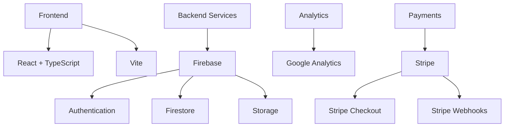

# B8 Platform

[](LICENSE)
[](CHANGELOG.md)
[](https://www.typescriptlang.org/)
[](https://reactjs.org/)
[](https://vitejs.dev/)
[](https://stripe.com)
[](CONTRIBUTING.md)

> **B8 Platform** is a focused mentoring and community platform, centered around the BGr8 initiative and powered by a unique MentorAlgorithm.


<details>
<summary>📖 Table of Contents</summary>

- [Overview](#overview)
- [Features](#-features)
- [Tech Stack](#%EF%B8%8F-tech-stack)
- [Prerequisites](#-prerequisites)
- [Installation](#-installation)
- [Deployment](#-deployment)
- [Environment Variables](#-environment-variables)
- [Testing](#-testing)
- [Project Structure](#-project-structure)
- [Contributing](#-contributing)
- [License](#-license)
- [Security](#-security)
- [Contact](#-contact)
- [Acknowledgments](#-acknowledgments)
</details>

## 🎯 Overview

B8 Platform is dedicated to empowering individuals through the BGr8 community and a robust mentoring program. The platform now focuses exclusively on:

| Unit | Description | Status |
|------|-------------|--------|
| 🌟 BGr8 | Community, events, and mentoring | Live |

## 🚀 Features

<details>
<summary>Click to expand feature list</summary>

### Core Features
- 🌟 BGr8 community hub
- 🤝 Mentor matching and management (MentorAlgorithm)
- 🔒 Secure authentication
- 💳 Secure payment processing with Stripe
- 📱 Responsive design
- 📊 Analytics integration
- 💬 Enquiries and admin management

### Technical Features
- 🔑 Firebase authentication
- 🔥 Firestore database
- 💸 Stripe payments
- ⚡ Real-time updates
- 🧑‍💻 Modern React + TypeScript stack
</details>

## 🛠️ Tech Stack

Our platform is built with modern technologies:



## 📋 Prerequisites

Before you begin, ensure you have:

- [ ] Node.js (v16.x or higher)
- [ ] npm (v8.x or higher)
- [ ] Firebase account and project
- [ ] Stripe account with API keys
- [ ] Stripe CLI (for webhook testing)

## 🛠️ Installation

<details>
<summary>Step-by-step installation guide</summary>

1. **Clone the repository:**
   ```bash
   git clone https://github.com/Hum2a/B8.git
   cd B8
   ```

2. **Install dependencies:**
   ```bash
   npm install
   ```

3. **Set up environment variables:**
   You will need your own firebase account.
   Get the correct `.env` file from Hum2a to place in the root directory.

4. **Set up Stripe server environment:**
   Place the stripe `.env` file provided by Hum2a into the stripe directory, or create it as follows:
   ```env
   STRIPE_SECRET_KEY=your_stripe_secret_key
   STRIPE_WEBHOOK_SECRET=your_stripe_webhook_secret
   PORT=3001
   CLIENT_URL=http://localhost:5173
   ```

5. **Start the development servers:**
   ```bash
   # Start the main application
   npm run dev

   # Start the Stripe server (in a separate terminal)
   cd stripe && node server.js
   ```
</details>

## 🚀 Local Deployment

<details>
<summary>Deployment instructions</summary>

### Production Build
```bash
npm run build
```

### Preview Production Build
```bash
npm run preview
```
</details>

## 📝 Environment Variables

Required environment variables:

<details>
<summary>View all environment variables</summary>

| Variable | Description | Required |
|----------|-------------|:---------:|
| `VITE_FIREBASE_API_KEY` | Firebase API Key | ✅ |
| `VITE_FIREBASE_AUTH_DOMAIN` | Firebase Auth Domain | ✅ |
| `VITE_FIREBASE_PROJECT_ID` | Firebase Project ID | ✅ |
| `VITE_FIREBASE_STORAGE_BUCKET` | Firebase Storage Bucket | ✅ |
| `VITE_FIREBASE_MESSAGING_SENDER_ID` | Firebase Messaging Sender ID | ✅ |
| `VITE_FIREBASE_APP_ID` | Firebase App ID | ✅ |
| `VITE_FIREBASE_MEASUREMENT_ID` | Firebase Measurement ID | ✅ |
| `VITE_STRIPE_PUBLISHABLE_KEY` | Stripe Publishable Key | ✅ |
| `VITE_STRIPE_SERVER_URL` | Stripe Server URL | ✅ |
| `STRIPE_SECRET_KEY` | Stripe Secret Key (server) | ✅ |
| `STRIPE_WEBHOOK_SECRET` | Stripe Webhook Secret (server) | ✅ |
</details>

## 🏷️ Release Tag Manager (`release.sh`)
A cross-platform bash script for managing semantic versioned release tags in Git repositories.

### Prerequisites
- Git installed and configured
- Remote repository set up (`origin`)
- Bash shell (works on Linux/macOS/Git Bash for Windows)
#### Alias Bash in Windows Powershell
```bash
Set-Alias -Name bash -Value "<absolute_path_to_git_installtion>\bin\bash.exe"  # e.g: C:\Program Files\Git\bin\bash.exe
```

### Usage
- Linux/MacOS
```bash
./release.sh [OPTIONS]
```
- Windows
```bash
bash release.sh [OPTIONS]
```

#### Options
| Flag | Description |
|------|-------------|
| `--major` | Increment major version (vX.0.0) |
| `--minor` | Increment minor version (v0.X.0) |
| `--patch` | Increment patch version (v0.0.X) (default) |
| `--name NAME` | Append custom name (e.g., `--name beta` → v1.0.0-beta) |
| `--set-tag TAG` | Set specific tag (must be vX.Y.Z format) |
| `--current` | Show current release tag |
| `--force` | Force tag creation on already-tagged commits |
| `--help` | Show this help message |

### Behavior
1. Always syncs with remote tags first
2. Validates tag format (vX.Y.Z or vX.Y.Z-NAME)
3. Prevents duplicate tags

## 🧪 Testing (WIP)

```bash
# Run unit tests
npm run test

# Run end-to-end tests
npm run test:e2e

# Run tests in CI environment
npm run test:ci
```

## 📦 Project Structure

<details>
<summary>View project structure</summary>

```
B8/
├── src/
│   ├── components/         # React components
│   ├── pages/              # Page components
│   ├── hooks/              # Custom React hooks
│   ├── contexts/           # React context providers
│   ├── services/           # API and service integrations
│   ├── utils/              # Utility functions
│   ├── types/              # TypeScript type definitions
│   └── MentorAlgorithm/    # Mentor matching logic
├── stripe/                 # Stripe server
├── public/                 # Static assets
├── ...
```
</details>

## 🤝 Contributing

See [CONTRIBUTING.md](CONTRIBUTING.md) for guidelines.

## 📝 License

This project is licensed under the [MIT License](LICENSE).

## 🔒 Security

See [SECURITY.md](SECURITY.md) for security policy and reporting.

## 📬 Contact

For questions, contact Humza (Hum2a) or open an issue.

## 🙏 Acknowledgments

Thanks to all contributors and the BGr8 community!
