<div align="center">


# 🌟 bgr8 Platform

> **Empowering individuals through community and mentorship**

[](https://opensource.org/licenses/MIT)
[](CHANGELOG.md)
[](https://www.typescriptlang.org/)
[](https://reactjs.org/)
[](https://vitejs.dev/)
[](https://firebase.google.com)
[](CONTRIBUTING.md)

---

**A focused mentoring and community platform, centered around the BGr8 initiative and powered by a unique MentorAlgorithm with advanced availability management and intelligent search capabilities.**

[🚀 Quick Start](#-quick-start) • [🌟 Ambassador Program](#-ambassador-program) • [📖 Documentation](#-documentation) • [🤝 Contributing](#-contributing) • [📄 License](#-license)

</div>

---

## 📋 Table of Contents

<details open>
<summary><strong>📖 Quick Navigation</strong></summary>

- [🎯 Overview](#-overview)
- [✨ Features](#-features)
- [🌟 Ambassador Program](#-ambassador-program)
- [🛠️ Tech Stack](#️-tech-stack)
- [📖 Documentation](#-documentation)
- [⚡ Quick Start](#-quick-start)
- [📋 Prerequisites](#-prerequisites)
- [🚀 Installation](#-installation)
- [🌐 Deployment](#-deployment)
- [🔧 Environment Variables](#-environment-variables)
- [📁 Project Structure](#-project-structure)
- [🤝 Contributing](#-contributing)
- [📄 License](#-license)
- [🔒 Security](#-security)
- [📞 Contact](#-contact)
- [🙏 Acknowledgments](#-acknowledgments)

</details>

---

## 🎯 Overview

<div align="center">

| 🏢 **Platform Unit** | 📝 **Description** | 🚀 **Status** |
|:--------------------:|:------------------:|:-------------:|
| 🌟 **BGr8** | Community, events, and mentoring | ✅ **Live** |

</div>

**bgr8 Platform** is dedicated to empowering individuals through the BGr8 community and a robust mentoring program. Our platform focuses exclusively on creating meaningful connections and fostering growth through:

- 🤝 **Community Building** - Connect with like-minded individuals
- 🎓 **Mentorship Programs** - Advanced algorithm-based matching with real-time availability
- ✅ **Mentor Verification** - Comprehensive verification system ensuring mentor quality and platform safety
- 🌟 **Ambassador Program** - Join our network of passionate advocates making a difference
- 📈 **Personal Growth** - Structured learning and development
- 🌍 **Diverse Network** - Inclusive and supportive environment
- 🔍 **Smart Discovery** - Intelligent search and filtering system
- 📅 **Flexible Scheduling** - Integrated availability management for mentors
- 📧 **Automated Communications** - Email notification system for seamless user experience

---

## ✨ Features

<details>
<summary><strong>🌟 Click to explore our amazing features!</strong></summary>

### 🎯 Core Features

| Feature | Description | Status |
|---------|-------------|:------:|
| 🌟 **BGr8 Community Hub** | Centralized community platform | ✅ Live |
| 🤝 **Mentor Matching** | Advanced MentorAlgorithm system with real-time availability | ✅ Live |
| ✅ **Mentor Verification System** | Comprehensive verification workflow with status tracking and admin review | ✅ Live |
| 🌟 **Ambassador Program** | Join our network of passionate advocates | ✅ Live |
| 📝 **Ambassador Applications** | Streamlined application process with admin management | ✅ Live |
| 🔍 **Smart Search System** | Intelligent search with dropdown suggestions and filtering | ✅ Live |
| 📅 **Cal.com Booking System** | Third-party calendar integration | ✅ Live |
| 📅 **Availability Management** | Direct mentor availability creation and management | ✅ Live |
| 📧 **Email Notification System** | Automated email templates for user notifications and communications | ✅ Live |
| 🔒 **Secure Authentication** | Firebase-powered security with email verification | ✅ Live |
| 📱 **Responsive Design** | Mobile-first approach | ✅ Live |
| 📊 **Admin Dashboard** | Comprehensive user, data, and verification management panel | ✅ Live |

### ⚡ Technical Features

| Technology | Purpose | Status |
|------------|---------|:------:|
| 🔑 **Firebase Auth** | User authentication | ✅ Live |
| 🔥 **Firestore DB** | Real-time database | ✅ Live |
| 📅 **Cal.com Integration** | Advanced booking system | ✅ Live |
| ⚡ **Real-time Updates** | Live data synchronization | ✅ Live |
| 🧑‍💻 **React + TypeScript** | Modern frontend stack | ✅ Live |
| 🎨 **CSS Variables** | Consistent design system | ✅ Live |

### 🆕 Recent Enhancements

| Feature | Description | Status |
|---------|-------------|:------:|
| ✅ **Mentor Verification Workflow** | Complete verification system with status tracking, admin review panel, and verification data collection (including birth year) | ✅ Live |
| 📧 **Email System** | Automated email templates for registration, verification, bookings, and notifications | ✅ Live |
| 🔍 **Enhanced Search** | Dropdown suggestions, smart filtering, and improved UI | ✅ Live |
| 📊 **Filter Tabs** | Relevant mentorship categories with count bubbles | ✅ Live |
| 👤 **Profile Modals** | Clickable mentor cards with full profile display | ✅ Live |
| 📅 **Availability Integration** | Real-time availability pulling from Cal.com and bookings | ✅ Live |
| 🛠️ **Data Generation** | Comprehensive testing tools for profiles and availability | ✅ Live |
| 🗑️ **Smart Cleanup** | Cascading deletes and bulk data management | ✅ Live |
| 🎨 **Enhanced UI** | Improved styling and user experience | ✅ Live |
| 🐛 **Advanced Feedback System** | Comprehensive testing feedback with file attachments | ✅ Live |
| 🔐 **Role-Based Access Control** | Admin/Developer role management and permissions | ✅ Live |
| 📎 **File Attachment System** | Firebase Storage integration for feedback tickets | ✅ Live |
| 🖼️ **Image Overlay Viewer** | Full-screen image viewing with download capabilities | ✅ Live |
| 📊 **Enhanced Analytics** | Detailed feedback analytics with CSV export | ✅ Live |

### 🐛 Feedback & Testing System

| Feature | Description | Status |
|---------|-------------|:------:|
| 🎫 **Ticket Management** | Create, edit, view, and delete feedback tickets | ✅ Live |
| 📎 **File Attachments** | Upload images, videos, documents (max 10MB each) | ✅ Live |
| 🏷️ **Smart Categorization** | Bug reports, feature requests, UI issues, performance | ✅ Live |
| ⭐ **Priority System** | Low, Medium, High, Critical priority levels | ✅ Live |
| 📊 **Status Tracking** | Draft, Open, In Progress, Resolved, Closed, Duplicate | ✅ Live |
| 💬 **Comments System** | Internal and public comments with attachments | ✅ Live |
| 👍 **Voting System** | Upvote/downvote tickets for prioritization | ✅ Live |
| 🔍 **Advanced Search** | Search by title, description, tags, and metadata | ✅ Live |
| 📈 **Analytics Dashboard** | Comprehensive feedback analytics with CSV export | ✅ Live |
| 🖼️ **Image Viewer** | Full-screen image overlay with download functionality | ✅ Live |
| 🎯 **Testing Fields** | Browser info, OS, device type, screen resolution | ✅ Live |
| 🔄 **Auto-Detection** | Automatic screen resolution and browser detection | ✅ Live |

### ✅ Mentor Verification System

| Feature | Description | Status |
|---------|-------------|:------:|
| 📋 **Verification Data Collection** | Comprehensive profile data collection including full name, year of birth, email, mobile, county, and LinkedIn | ✅ Live |
| 🔄 **Verification Workflow** | Multi-stage verification process (pending → under_review → approved/rejected) | ✅ Live |
| 👨‍💼 **Admin Review Panel** | Dedicated admin interface for reviewing and managing mentor verification applications | ✅ Live |
| 📊 **Verification Status Tracking** | Real-time status updates: pending, under_review, approved, rejected, suspended, revoked | ✅ Live |
| 📈 **Verification Statistics** | Dashboard with verification metrics and statistics | ✅ Live |
| 📝 **Verification History** | Complete audit trail of verification status changes and admin actions | ✅ Live |
| 🎯 **Age Verification** | Year of birth collection for age gating (mandatory for mentors) | ✅ Live |
| 🔗 **Social Verification** | LinkedIn profile requirement for mentor verification | ✅ Live |

### 🔐 Security Features

| Feature | Description | Status |
|---------|-------------|:------:|
| 🛡️ **Input Validation** | Comprehensive data sanitization | ✅ Live |
| 🔒 **Rate Limiting** | API and authentication rate limiting | ✅ Live |
| 🚫 **XSS Protection** | Cross-site scripting prevention | ✅ Live |
| 🛡️ **CSRF Protection** | Cross-site request forgery prevention | ✅ Live |
| 🔐 **Password Security** | Strong password requirements (12+ chars) | ✅ Live |
| 🗑️ **Cascading Deletes** | Maintains database integrity | ✅ Live |
| 👥 **Role-Based Access** | Admin/Developer role management and permissions | ✅ Live |
| ✅ **Mentor Verification** | Verification system ensures mentor quality and platform safety | ✅ Live |

</details>

---

## 🌟 Ambassador Program

<div align="center">

**Join our network of passionate advocates making a real difference in communities worldwide! 🌍**

</div>

### 🤝 What is the BGr8 Ambassador Program?

The BGr8 Ambassador Program is our community-driven initiative that empowers passionate individuals to spread our mission of creating positive change through mentorship and community development.

### ✨ Key Features

| Feature | Description | Benefits |
|---------|-------------|----------|
| 🌟 **Community Advocacy** | Represent BGr8 in your local community | Build meaningful connections and make an impact |
| 🤝 **Network Building** | Connect potential mentors and mentees | Expand your professional and personal network |
| 📈 **Personal Growth** | Develop leadership and communication skills | Enhance your professional profile |
| 🎯 **Event Organization** | Organize and participate in community events | Strengthen community bonds and visibility |
| 💬 **Feedback & Insights** | Provide valuable feedback to improve our programs | Shape the future of mentorship |

### 🚀 How to Become an Ambassador

1. **📝 Apply Online**: Visit our [Ambassador Page](/ambassador) to submit your application
2. **📋 Complete Application**: Fill out our comprehensive application form with:
   - Personal information and experience
   - Motivation and availability
   - Social media presence (Instagram, LinkedIn, Twitter, Facebook, TikTok, YouTube)
   - Location and community involvement
3. **👥 Admin Review**: Our team reviews your application thoroughly
4. **✅ Approval & Onboarding**: Get approved and receive your ambassador role
5. **🌟 Start Making Impact**: Begin representing BGr8 in your community

### 📊 Program Statistics

- **500+ Active Ambassadors** across the globe
- **50+ Countries** represented
- **10,000+ Lives Impacted** through ambassador efforts
- **Real-time Tracking** of ambassador activities and impact

### 🎯 Ambassador Responsibilities

- **Share BGr8's Mission**: Spread awareness about our platform and values
- **Connect People**: Introduce potential mentors and mentees to our platform
- **Organize Events**: Plan and participate in community events and activities
- **Provide Feedback**: Share insights to help improve our programs
- **Professional Representation**: Represent BGr8 professionally in your community

### 💡 Benefits of Being an Ambassador

- **🌟 Make an Impact**: Create meaningful change in your community
- **🤝 Build Connections**: Connect with mentors, mentees, and fellow ambassadors
- **📈 Personal Growth**: Develop leadership and communication skills
- **🌍 Global Network**: Join a worldwide network of passionate advocates
- **📚 Learning Opportunities**: Access to exclusive resources and training

### 🔧 Admin Management

Our comprehensive admin system allows administrators to:
- **Review Applications**: Thoroughly evaluate ambassador applications
- **Track Statistics**: Monitor active ambassadors vs. applications
- **Manage Approvals**: Approve/reject applications with automatic role assignment
- **Monitor Impact**: Track ambassador activities and community engagement

*Learn more about admin management in our [Admin Portal Overview](docs/ADMIN_PORTAL_OVERVIEW.md)*

---

## 🛠️ Tech Stack

```mermaid
graph TD
    A[🎨 Frontend] --> B[⚛️ React + TypeScript]
    A --> C[⚡ Vite 6.1]
    A --> D[🎨 CSS Variables]
    E[🔧 Backend Services] --> F[🔥 Firebase 11.3]
    F --> G[🔐 Authentication]
    F --> H[🗄️ Firestore]
    F --> I[📦 Storage]
    L[📅 Booking System] --> M[🌐 Cal.com API]
    L --> N[📅 Availability Management]
    L --> O[📋 Event Types]
    L --> P[📊 Bookings Management]
    R[🛠️ Admin Tools] --> S[👥 Profile Generation]
    R --> T[📅 Availability Generation]
    R --> U[🗑️ Data Cleanup]
    R --> Z[🐛 Feedback System]
    V[🛡️ Security] --> W[🔒 Rate Limiting]
    V --> X[🛡️ Input Validation]
    V --> Y[🔐 Password Security]
    V --> AA[👥 Role-Based Access]
    BB[📎 File Management] --> CC[🖼️ Image Overlay]
    BB --> DD[📥 File Downloads]
    BB --> EE[📦 Firebase Storage]
    
    style A fill:#61DAFB
    style E fill:#FFCA28
    style F fill:#FF6B35
    style L fill:#00E676
    style R fill:#FF9800
    style V fill:#E91E63
    style BB fill:#9C27B0
```

<div align="center">



**Our platform leverages cutting-edge technologies for optimal performance and user experience.**

</div>

---

## 📖 Documentation

### 🏢 Admin Documentation
- [🏢 **Admin Portal Overview**](docs/ADMIN_PORTAL_OVERVIEW.md) - Complete admin portal guide and features
- [🐛 **Testing Feedback System**](docs/ADMIN_TESTING_FEEDBACK_GUIDE.md) - Detailed feedback management guide
- [⚡ **Admin Quick Reference**](docs/ADMIN_QUICK_REFERENCE.md) - Quick reference for common admin tasks

### 🛠️ Technical Documentation
- [📋 Changelog](CHANGELOG.md) - Detailed version history and updates
- [🤝 Contributing Guide](CONTRIBUTING.md) - How to contribute to the project
- [🔒 Security Policy](SECURITY.md) - Security guidelines and reporting
- [📄 License](LICENSE) - MIT License details

### 📚 Additional Resources
- [🏗️ Architecture Overview](docs/ARCHITECTURE.md) - System architecture and design decisions
- [🔧 Development Setup](docs/DEVELOPMENT_SETUP.md) - Detailed development environment setup
- [🚀 Deployment Guide](docs/DEPLOYMENT.md) - Production deployment instructions
- [📊 API Documentation](docs/API.md) - API endpoints and usage

---

## ⚡ Quick Start

<div align="center">

**Get up and running in under 5 minutes! 🚀**

</div>

### 1️⃣ Clone the repository

```bash
git clone https://github.com/Hum2a/bgr8.git
cd bgr8
```

### 2️⃣ Install dependencies

```bash
npm install
```

### 3️⃣ Set up environment

Get `.env` file from Hum2a (see Environment Variables section for details)

### 4️⃣ (Optional) Start Firebase emulators for development

For local development with Firebase emulators, see detailed setup instructions in [firebase_emulator/README.md](firebase_emulator/README.md)

### 5️⃣ Start development server

```bash
npm run dev
```

---

## 📋 Prerequisites

<div align="center">

**Before you begin, ensure you have the following installed:**

</div>

| Requirement | Version | Download |
|-------------|---------|----------|
| 🟢 **Node.js** | `v16.x` or higher | [Download](https://nodejs.org/) |
| 📦 **npm** | `v8.x` or higher | [Included with Node.js](https://nodejs.org/) |
| 🔥 **Firebase Account** | Any | [Sign Up](https://firebase.google.com/) |

---

## 🚀 Installation

<details>
<summary><strong>📋 Detailed Installation Guide</strong></summary>

### Step 1: Repository Setup

```bash
# Clone the repository
git clone https://github.com/Hum2a/bgr8.git

# Navigate to project directory
cd bgr8
```

### Step 2: Dependencies Installation

```bash
# Install all dependencies
npm install
```

### Step 3: Environment Configuration

> **⚠️ Important:** You will need your own Firebase account.
> Get the correct `.env` file from Hum2a to place in the root directory.

### Step 4: Launch Development Server

```bash
# Start the main application
npm run dev
```

**🎉 Congratulations! Your development environment is now ready.**

</details>

---

## 🌐 Deployment

<details>
<summary><strong>🚀 Deployment Instructions</strong></summary>

### Production Build

```bash
# Create optimized production build
npm run build

# Preview production build locally
npm run preview
```

### Deployment Options

| Platform | Instructions | Status |
|----------|-------------|:------:|
| 🚀 **Vercel** | Connect GitHub repo | ✅ Supported |
| ☁️ **Netlify** | Drag & drop build folder | ✅ Supported |
| 🔥 **Firebase Hosting** | `firebase deploy` | ✅ Supported |

</details>

---

## 🔧 Environment Variables

<div align="center">

**Required environment variables for full functionality**

</div>

<details>
<summary><strong>🔐 View all environment variables</strong></summary>

### Frontend Variables (`.env`)

| Variable | Description | Required | Example |
|----------|-------------|:--------:|---------|
| `VITE_FIREBASE_API_KEY` | Firebase API Key | ✅ | `AIzaSyC...` |
| `VITE_FIREBASE_AUTH_DOMAIN` | Firebase Auth Domain | ✅ | `project.firebaseapp.com` |
| `VITE_FIREBASE_PROJECT_ID` | Firebase Project ID | ✅ | `your-project-id` |
| `VITE_FIREBASE_STORAGE_BUCKET` | Firebase Storage Bucket | ✅ | `project.appspot.com` |
| `VITE_FIREBASE_MESSAGING_SENDER_ID` | Firebase Messaging Sender ID | ✅ | `123456789` |
| `VITE_FIREBASE_APP_ID` | Firebase App ID | ✅ | `1:123456789:web:abc123` |
| `VITE_FIREBASE_MEASUREMENT_ID` | Firebase Measurement ID | ✅ | `G-XXXXXXXXXX` |
| `VITE_USE_EMULATORS` | Enable Firebase emulators for development | ⚠️ | `true` or `false` |

</details>

---

## 🏷️ Release Tag Manager

<div align="center">

**`release.sh`** - A cross-platform bash script for managing semantic versioned release tags

</div>

### Prerequisites

- ✅ Git installed and configured
- ✅ Remote repository set up (`origin`)
- ✅ Bash shell (works on Linux/macOS/Git Bash for Windows)

#### Windows PowerShell Alias Setup

```powershell
Set-Alias -Name bash -Value "<absolute_path_to_git_installation>\bin\bash.exe"
# Example: C:\Program Files\Git\bin\bash.exe
```

### Usage

```bash
# Linux/MacOS
./release.sh [OPTIONS]

# Windows
bash release.sh [OPTIONS]
```

### Available Options

| Flag | Description | Example |
|------|-------------|---------|
| `--major` | Increment major version | `v2.0.0` |
| `--minor` | Increment minor version | `v1.1.0` |
| `--patch` | Increment patch version | `v1.0.1` (default) |
| `--name NAME` | Append custom name | `--name beta` → `v1.0.0-beta` |
| `--set-tag TAG` | Set specific tag | `--set-tag v1.2.3` |
| `--current` | Show current release tag | Displays current version |
| `--force` | Force tag creation | Override existing tags |
| `--help` | Show help message | Display usage information |

### Behavior

1. 🔄 **Always syncs** with remote tags first
2. ✅ **Validates** tag format (vX.Y.Z or vX.Y.Z-NAME)
3. 🚫 **Prevents** duplicate tags

---

## 📁 Project Structure

<details>
<summary><strong>📂 View complete project structure</strong></summary>

```
bgr8/
├── 📁 src/
│   ├── 🧩 components/         # React components
│   │   ├── 👨‍💼 admin/          # Admin-specific components
│   │   │   ├── 📊 Analytics components (FeedbackAnalytics, BookingAnalytics)
│   │   │   ├── 🎲 GenerateRandomProfile.tsx
│   │   │   ├── 👥 MentorManagement.tsx
│   │   │   ├── 📋 Bookings management (BookingsTable, BookingsGrouped)
│   │   │   ├── 📅 SessionsManagement.tsx
│   │   │   ├── 🔧 Admin utilities (AdminMentorModal, BookingDetailsModal)
│   │   │   └── 🐛 Feedback system (RoleManagement, RoleManagementModal)
│   │   ├── 🎬 animations/      # Animation components (LoadingSpinner)
│   │   ├── 🎨 ui/              # UI components
│   │   ├── 📝 feedback/        # Feedback components (StatsTiles)
│   │   ├── 📅 sessions/        # Session-related components
│   │   ├── 🧩 modals/          # Modal components
│   │   │   ├── 🐛 Feedback modals (CreateTicketModal, ViewTicketModal, EditTicketModal)
│   │   │   ├── 🖼️ ImageOverlay.tsx
│   │   │   ├── 💬 CommentsSidebar.tsx
│   │   │   └── 🗑️ DeleteTicketModal.tsx
│   │   └── 🧠 widgets/         # Widget components
│   │       └── 🎓 MentorAlgorithm/  # Mentor matching logic
│   │           ├── 📅 availability/  # Availability management
│   │           ├── 📅 booking/       # Booking system
│   │           ├── 🔗 CalCom/        # Cal.com integration
│   │           └── 🧮 algorithm/     # Matching algorithm (matchUsers.ts)
│   ├── 📄 pages/              # Page components
│   │   ├── 👨‍💼 adminPages/      # Admin pages (AdminPortal, AdminEnquiries, AdminSettings)
│   │   ├── 🔐 authPages/       # Authentication pages (SignIn, Register, ForgotPassword)
│   │   ├── 💼 businessPages/   # Business pages (BGr8)
│   │   ├── 🎓 mentorPages/     # Mentor-related pages
│   │   └── 🛠️ utilPages/        # Utility pages (Profile, Settings, Feedback)
│   ├── 🎨 styles/             # CSS stylesheets
│   │   ├── 👨‍💼 adminStyles/    # Admin-specific styles
│   │   ├── 💼 businessStyles/  # Business-specific styles
│   │   ├── 🧩 components/      # Component-specific styles
│   │   └── 💳 payment/         # Payment-related styles (Success, Cancel)
│   ├── 🪝 hooks/              # Custom React hooks (useAuth, useIsMobile)
│   ├── 🔄 contexts/           # React context providers (AuthContext)
│   ├── 🛠️ utils/              # Utility functions
│   │   ├── 🔐 security.ts      # Security utilities
│   │   ├── 🛡️ securityMonitor.ts # Security monitoring
│   │   ├── 👤 userProfile.ts   # User profile utilities
│   │   ├── 🎨 iconMapping.tsx  # Icon mapping utilities
│   │   ├── 📱 screenResolution.ts # Screen resolution detection
│   │   ├── 📥 fileDownload.ts  # File download utilities
│   │   └── 🔄 updatePermissions.ts # Permission management
│   ├── 📝 types/              # TypeScript type definitions
│   │   ├── 👤 user.ts          # User profile types
│   │   ├── 📅 sessions.ts      # Session types
│   │   ├── 📋 bookings.ts      # Booking types
│   │   ├── 🏢 b8fc.ts          # Business types
│   │   ├── 👨‍💼 admin.ts         # Admin types
│   │   ├── 🐛 feedback.ts      # Feedback system types
│   │   └── 🔐 verification.ts  # Verification types
│   ├── 🔥 firebase/           # Firebase configuration
│   │   ├── 🔧 firebase.tsx     # Main Firebase config
│   │   └── 🛠️ emulatorUtils.ts # Emulator utilities
│   ├── 🛡️ middleware/         # Security middleware
│   ├── 🧭 navigation/         # Navigation logic (navigation.tsx)
│   ├── 📊 constants/          # Application constants
│   │   ├── 🎓 skillsByCategory.ts
│   │   ├── 🏛️ ukEducationLevels.ts
│   │   ├── 🏢 industries.ts
│   │   ├── 🎨 hobbiesByCategory.ts
│   │   ├── 🏛️ religionOptions.ts
│   │   ├── 🌍 ethnicityOptions.ts
│   │   └── 🗺️ ukCounties.ts
│   ├── 📊 data/              # Sample data and autofill
│   │   └── 🎲 autofillData.ts # Test data for development
│   ├── 🔧 config/             # Configuration files (security.ts)
│   ├── 🎨 assets/             # Static assets (images, etc.)
│   └── 🔧 services/           # Service layer
│       ├── 📅 sessionsService.ts
│       ├── 🐛 feedbackService.ts
│       ├── 👨‍💻 developerFeedbackService.ts
│       ├── 👥 mentorFeedbackService.ts
│       ├── 🔐 verificationService.ts
│       └── 📊 pagePermissionsService.ts
├── 🌐 public/                 # Public static assets
├── 🔥 firebase_emulator/      # Firebase emulator configuration
│   ├── 📄 README.md           # Emulator setup instructions
│   ├── 📜 download_cloud_data.sh # Data export script
│   ├── ⚙️ firebase.json       # Firebase configuration
│   ├── 🔧 .firebaserc        # Firebase project configuration
│   ├── 🛡️ firestore.rules    # Firestore security rules
│   ├── 📁 storage.rules      # Storage security rules
│   └── 📊 data/              # Exported data storage
├── 📄 docs/                  # Documentation files
├── 🔒 .env                   # Environment variables
├── 📦 package.json           # Dependencies and scripts
├── ⚙️ vite.config.ts         # Vite configuration
├── 📝 tsconfig.json          # TypeScript configuration
├── 🎨 eslint.config.js       # ESLint configuration
├── 🏷️ release.sh             # Release tag manager script
└── 📄 README.md              # This file
```

</details>

---

## 🤝 Contributing

<div align="center">

**We welcome contributions from the community! 🌟**

</div>

<details>
<summary><strong>📋 Contributing Guidelines</strong></summary>

### How to Contribute

1. 🍴 **Fork** the repository
2. 🌿 **Create** a feature branch (`git checkout -b feature/amazing-feature`)
3. 💾 **Commit** your changes (`git commit -m 'Add amazing feature'`)
4. 📤 **Push** to the branch (`git push origin feature/amazing-feature`)
5. 🔄 **Open** a Pull Request

### Development Guidelines

- ✅ Follow TypeScript best practices
- 🎨 Maintain consistent code style using CSS variables
- 📝 Write meaningful commit messages
- 📚 Update documentation as needed
- 🔍 Ensure proper contrast for UI elements
- 📱 Test responsive design across devices

### Code of Conduct

We are committed to providing a welcoming and inspiring community for all. Please read our [Code of Conduct](CODE_OF_CONDUCT.md) for details.

</details>

---

## 📄 License

<div align="center">

**This project is licensed under the MIT License - see the [LICENSE](LICENSE) file for details.**

[](https://opensource.org/licenses/MIT)

</div>

---

## 🔒 Security

<div align="center">

**Security is our top priority**

</div>

<details>
<summary><strong>🛡️ Security Information</strong></summary>

### Reporting Security Issues

If you discover a security vulnerability, please:

1. 🔒 **Do NOT** create a public GitHub issue
2. 📧 **Email** us directly at [security@bgr8.com](mailto:security@bgr8.com)
3. ⏰ **Wait** for our response (we aim to respond within 24 hours)

### Security Features

- 🔐 **Firebase Authentication** - Secure user management
- 🛡️ **Input Validation** - Comprehensive data sanitization
- 🔒 **HTTPS Only** - Encrypted data transmission
- 🚫 **XSS Protection** - Cross-site scripting prevention
- 🛡️ **CSRF Protection** - Cross-site request forgery prevention
- 🗑️ **Cascading Deletes** - Maintains database integrity
- 🔒 **Rate Limiting** - API and authentication rate limiting
- 🔐 **Password Security** - Strong password requirements (12+ characters)
- 🛡️ **Security Headers** - Comprehensive security headers
- 🔒 **Session Management** - Secure session handling

### Security Tools

- 🛡️ **ESLint Security** - Security-focused linting
- 🔍 **Snyk** - Vulnerability scanning
- 📊 **Security Monitoring** - Real-time security monitoring
- 🔐 **Middleware Security** - Request validation and sanitization

</details>

---

## 📞 Contact

<div align="center">

**Get in touch with our team**

</div>

| Contact Method | Details |
|----------------|---------|
| 👨‍💻 **Developer** | Humza (Hum2a) |
| 🐛 **Issues** | [GitHub Issues](https://github.com/Hum2a/bgr8/issues) |
| 📧 **Email** | [Contact Us](mailto:contact@bgr8.com) |

---

## 🙏 Acknowledgments

<div align="center">

**Special thanks to all contributors and the amazing BGr8 community! 🌟**

</div>

### Contributors

<table>
<tr>
<td align="center">
<a href="https://github.com/Hum2a">

<br />
<sub><b>Hum2a</b></sub>
</a>
<br />
<sub>Humza Butt</sub>
</td>
<td align="center">
<a href="https://github.com/YakMan101">

</a>
<br />
<sub><b>YakMan101</b></sub>
<br />
<sub>Shayak Hussain</sub>
</td>
<td align="center">
<a href="https://github.com/aoladuti1">

<br />
<sub><b>aoladuti1</b></sub>
</a>
<br />
<sub>Antonio Oladuti</sub>
</td>
</tr>
</table>

### Technologies & Libraries

- ⚛️ **React 18.2** - UI framework
- 🔥 **Firebase 11.3** - Backend services
- 📅 **Cal.com** - Calendar & booking system
- ⚡ **Vite 6.1** - Build tool
- 🎨 **CSS3** - Styling with CSS variables
- 🔍 **Search Algorithms** - Intelligent filtering and discovery
- 📊 **Data Management** - Comprehensive testing and cleanup tools
- 🛡️ **Security Tools** - ESLint security, Snyk, custom security middleware

---

<div align="center">

**Made with ❤️ by the BGr8 Team**

[⬆️ Back to top](#-bgr8-platform)

</div>
