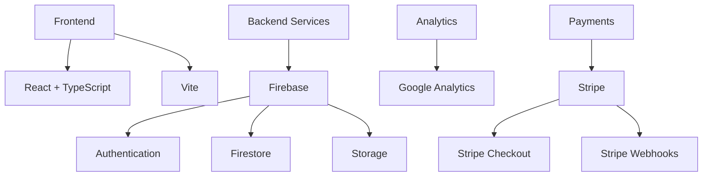

# B8 Network Platform 

[](LICENSE)
[](CHANGELOG.md)
[](https://www.typescriptlang.org/)
[](https://reactjs.org/)
[](https://vitejs.dev/)
[](https://stripe.com)
[](CONTRIBUTING.md)

> 🌟 **B8 Network** is an integrated business solutions and sports league platform that connects businesses and individuals across marketing, sports leagues, fashion, automotive, and entertainment sectors.

<details>
<summary>📖 Table of Contents</summary>

- [Overview](#overview)
- [Features](#-features)
- [Tech Stack](#%EF%B8%8F-tech-stack)
- [Prerequisites](#-prerequisites)
- [Installation](#-installation)
- [Deployment](#-deployment)
- [Environment Variables](#-environment-variables)
- [Testing](#-testing)
- [Project Structure](#-project-structure)
- [Contributing](#-contributing)
- [License](#-license)
- [Security](#-security)
- [Contact](#-contact)
- [Acknowledgments](#-acknowledgments)
</details>

## 🎯 Overview

B8 Network is revolutionizing the way businesses and individuals connect across multiple sectors. Our platform integrates:

| Business Unit | Description | Status |
|--------------|-------------|---------|
| 🏆 B8 League | Professional sports management | Live |
| 📈 Innov8 | Digital marketing solutions | Live |
| 🚗 B8 Car Club | Automotive community | Beta |
| 👕 B8 Clothing | Fashion & merchandise | Coming Soon |
| 🎭 BGr8 | Entertainment & events | Live |

## 🚀 Features

<details>
<summary>Click to expand feature list</summary>

### Core Features
- ✨ Professional networking and business solutions
- 🏆 Sports league management
- 📊 Marketing services (Innov8)
- 🚗 Automotive community (B8 Car Club)
- 👕 Fashion and merchandise (B8 Clothing)
- 🎉 Entertainment and events (BGr8)

### Technical Features
- 🔐 Secure authentication
- 💳 Secure payment processing with Stripe
- 📱 PWA support
- 🎨 Responsive design
- 📊 Analytics integration
- 🔄 Real-time updates
- 💰 Donation system with Stripe Checkout
</details>

## 🛠️ Tech Stack

Our platform is built with modern technologies:



## 📋 Prerequisites

Before you begin, ensure you have:

- [ ] Node.js (v16.x or higher)
- [ ] npm (v8.x or higher)
- [ ] Firebase account and project
- [ ] Stripe account with API keys
- [ ] Stripe CLI (for webhook testing)

## 🔧 Installation

<details>
<summary>Step-by-step installation guide</summary>

1. **Clone the repository:**
   ```bash
   git clone https://github.com/Hum2a/B8.git
   cd B8
   ```

2. **Install dependencies:**
   ```bash
   npm install
   ```

3. **Set up environment variables:**
   You will need your own firebase account.
   Get the correct `.env` file from Hum2a to place in the root directory.

4. **Set up Stripe server environment:**
   Typically you will just place the stripe `.env` file provided by Hum2a into the stripe directory.
   If that's too easy for you, create a `.env` file in the stripe directory:
   ```env
   STRIPE_SECRET_KEY=your_stripe_secret_key
   STRIPE_WEBHOOK_SECRET=your_stripe_webhook_secret
   PORT=3001
   CLIENT_URL=http://localhost:5173
   ```

5. **Start the development servers:**
   ```bash
   # Start the main application
   npm run dev

   # Start the Stripe server (in a separate terminal)
   cd stripe && node server.js
   ```
</details>

## 🚀 Deployment

<details>
<summary>Deployment instructions</summary>

### Production Build
```bash
npm run build
```

### Preview Production Build
```bash
npm run preview
```
</details>

## 📝 Environment Variables

Required environment variables:

<details>
<summary>View all environment variables</summary>

| Variable | Description | Required |
|----------|-------------|:---------:|
| `VITE_FIREBASE_API_KEY` | Firebase API Key | ✅ |
| `VITE_FIREBASE_AUTH_DOMAIN` | Firebase Auth Domain | ✅ |
| `VITE_FIREBASE_PROJECT_ID` | Firebase Project ID | ✅ |
| `VITE_FIREBASE_STORAGE_BUCKET` | Firebase Storage Bucket | ✅ |
| `VITE_FIREBASE_MESSAGING_SENDER_ID` | Firebase Messaging Sender ID | ✅ |
| `VITE_FIREBASE_APP_ID` | Firebase App ID | ✅ |
| `VITE_FIREBASE_MEASUREMENT_ID` | Firebase Measurement ID | ✅ |
| `VITE_STRIPE_PUBLISHABLE_KEY` | Stripe Publishable Key | ✅ |
| `VITE_STRIPE_SERVER_URL` | Stripe Server URL | ✅ |
| `STRIPE_SECRET_KEY` | Stripe Secret Key (server) | ✅ |
| `STRIPE_WEBHOOK_SECRET` | Stripe Webhook Secret (server) | ✅ |
</details>

## 🧪 Testing

```bash
# Run unit tests
npm run test

# Run end-to-end tests
npm run test:e2e

# Run tests in CI environment
npm run test:ci
```

## 📦 Project Structure

<details>
<summary>View project structure</summary>

```
b8-network/
├── 📁 src/                    # Source files
│   ├── 📱 components/        # React components
│   ├── 📄 pages/            # Page components
│   ├── 🎣 hooks/            # Custom React hooks
│   ├── 🌍 context/          # React context providers
│   ├── 🔌 services/         # API and service integrations
│   ├── 🛠️ utils/            # Utility functions
│   ├── 📝 types/            # TypeScript type definitions
│   └── 🎨 assets/           # Static assets
├── 📂 public/               # Public static files
├── 🧪 tests/                # Test files
├── 📚 docs/                 # Documentation
└── 💳 stripe/               # Stripe server implementation
    ├── server.js           # Express server setup
    ├── stripe.js           # Stripe integration logic
    └── config.js           # Server configuration
```
</details>

## 🤝 Contributing

We welcome contributions! Please read our [Contributing Guide](CONTRIBUTING.md) for details.

<details>
<summary>Quick contribution steps</summary>

1. Fork the Project
2. Create your Feature Branch (\`git checkout -b feature/AmazingFeature\`)
3. Commit your Changes (\`git commit -m 'Add some AmazingFeature'\`)
4. Push to the Branch (\`git push origin feature/AmazingFeature\`)
5. Open a Pull Request
</details>

## 📄 License

This project is licensed under the MIT License - see the [LICENSE](LICENSE) file for details.

## 🔒 Security

For security concerns, please email [security@b8network.co.uk](mailto:security@b8network.co.uk)

## 📧 Contact

<details>
<summary>Ways to reach us</summary>

- 🌐 Website: [b8network.co.uk](https://b8network.co.uk)
- 📧 Email: [contact@b8network.co.uk](mailto:contact@b8network.co.uk)
- 🐦 Twitter: [@B8Network](https://twitter.com/B8Network)
- 💼 LinkedIn: [B8 Network](https://www.linkedin.com/company/b8network)
</details>

## 🙏 Acknowledgments

<details>
<summary>Special thanks to</summary>

- 👥 All our contributors and community members
- 🌟 Open source projects we depend on
- 🧪 Our beta testers and early adopters
</details>

---

<div align="center">

**Made with ❤️ by the B8 Network Team**

[Report Bug](https://github.com/yourusername/b8-network/issues) · [Request Feature](https://github.com/yourusername/b8-network/issues)

</div>
