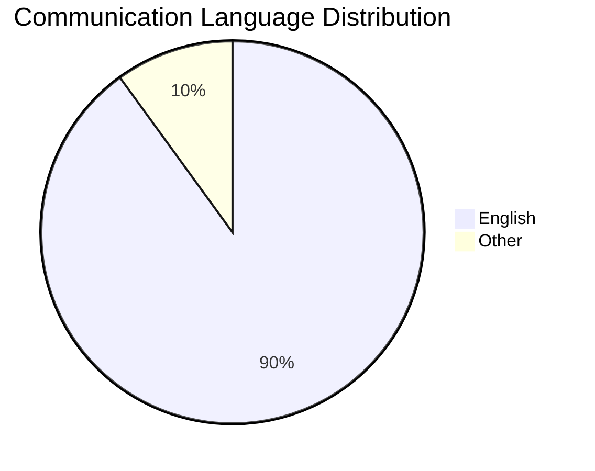

# 🔒 Security Policy

[](https://securityheaders.com/?q=b8network.co.uk)
[](https://b8network.co.uk)
[](https://developer.mozilla.org/en-US/docs/Web/HTTP/CSP)

> 🛡️ At B8 Network, we take security seriously. This document outlines our security procedures and policies.

<details>
<summary>📖 Table of Contents</summary>

- [Supported Versions](#supported-versions)
- [Reporting a Vulnerability](#reporting-a-vulnerability)
- [Security Measures](#security-measures)
- [Bug Bounty Program](#bug-bounty-program)
</details>

## 📋 Supported Versions

We maintain security updates for the following versions:

| Version | Support Status | End of Support |
|---------|---------------|----------------|
| 1.0.x   | ✅ Active     | TBD           |
| < 1.0   | ❌ End of Life| N/A           |

## 🔍 Reporting a Vulnerability

### ⚠️ Important: Do Not Create Public Issues

> 🚫 **Please do not report security vulnerabilities through public GitHub issues.**

### 📧 Preferred Method

1. Email us at [security@b8network.co.uk](mailto:security@b8network.co.uk)
2. Expect initial response within 48 hours
3. We'll create a private security advisory if needed

### 📝 Required Information

<details>
<summary>Information to include in your report</summary>

#### Essential Details
- [ ] Type of issue
- [ ] Full paths of source file(s)
- [ ] Location of affected source code
- [ ] Any special configuration required
- [ ] Step-by-step reproduction instructions
- [ ] Proof-of-concept or exploit code
- [ ] Impact of the issue

#### Example Report Format
```markdown
## Issue Type
[e.g., XSS, CSRF, SQL Injection]

## Affected Files
- /path/to/file1
- /path/to/file2

## Steps to Reproduce
1. ...
2. ...
3. ...

## Impact
[Describe potential impact]
```
</details>

## 🛡️ Security Measures

We implement various security measures to protect our users:

<details>
<summary>View our security features</summary>

### 🔒 Authentication
- ✅ Multi-factor authentication
- ✅ Secure password policies
- ✅ Session management
- ✅ Rate limiting

### 🔐 Data Protection
- ✅ End-to-end encryption
- ✅ Secure data storage
- ✅ Regular security audits
- ✅ Automated vulnerability scanning

### 🌐 Network Security
- ✅ HTTPS everywhere
- ✅ Content Security Policy
- ✅ DDoS protection
- ✅ Regular penetration testing
</details>

## 💰 Bug Bounty Program

While we currently don't have a formal bug bounty program, we show appreciation for security researchers:

<details>
<summary>Recognition Program</summary>

### 🏆 Rewards
- Public acknowledgment (if desired)
- Letter of appreciation
- Potential for security advisory collaboration

### 🎯 Scope
- Web application vulnerabilities
- API security issues
- Authentication bypasses
- Data exposure risks
</details>

## 🌐 Preferred Languages



We prefer all security communications in English to ensure clear understanding.

---

<div align="center">

**Thank you for helping keep B8 Network secure! 🛡️**

[](https://b8network.co.uk)

</div>
